# Service Provider Onboarding Portal

A MERN stack application where service providers register, complete their profile, upload verification documents, and submit an application for admin review. Admins can search/filter providers, view documents, and approve or reject applications with remarks.

## Tech Stack

- **Frontend:** React (Vite), React Router, Tailwind CSS, React Hook Form, Axios, React Hot Toast, Recharts (admin dashboard charts), Lucide React (icons)
- **Backend:** Node.js, Express, MongoDB (Mongoose), JWT Authentication, Multer + Cloudinary (file uploads), express-validator
- **AI (optional):** Google Gemini API (`gemini-3.6-flash`) with structured JSON outputs (Zod → JSON Schema) for admin-assist and provider-assist features

## Folder Structure

```
Service_Provider_Onboarding_Portal/
├── backend/                # Express + MongoDB API
│   ├── src/
│   │   ├── config/         # DB connection
│   │   ├── constants/      # Roles & status enums
│   │   ├── controllers/    # Route handlers
│   │   ├── middleware/     # Auth, error handling, upload, validation
│   │   ├── models/         # Mongoose schemas
│   │   ├── routes/         # API route definitions
│   │   ├── scripts/        # createAdmin seed script
│   │   ├── utils/          # ApiError, ApiResponse, asyncHandler, JWT helper
│   │   ├── validators/     # express-validator rule sets
│   │   ├── app.js
│   │   └── server.js
├── frontend/               # React (Vite) frontend
│   └── src/
│       ├── api/            # Axios calls grouped by feature
│       ├── components/     # common / layout / provider / admin components
│       ├── context/        # AuthContext (JWT + user state)
│       ├── pages/           # Login, Register, provider & admin pages
│       ├── routes/         # ProtectedRoute + AppRoutes
│       └── utils/          # Shared constants
└── docs/
    └── postman_collection.json
```

## Getting Started

### Prerequisites
- Node.js 18+
- A running MongoDB instance (local or Atlas)
- A free [Cloudinary](https://cloudinary.com) account (for file uploads — see below)

### 1. Backend Setup

```bash
cd backend
npm install
cp .env.example .env   # then edit MONGO_URI / JWT_SECRET / CLOUDINARY_* as needed
npm run dev
```

Profile photos and verification documents upload straight to Cloudinary rather than this server's own disk, so they survive restarts and redeploys even on hosts with no persistent disk. Sign up free at [cloudinary.com](https://cloudinary.com) and copy the three values from your Dashboard home page into `CLOUDINARY_CLOUD_NAME` / `CLOUDINARY_API_KEY` / `CLOUDINARY_API_SECRET` — uploads return a `503` until these are set.

The API runs on `http://localhost:5000` by default. Health check: `GET /api/health`.

Interactive API docs (Swagger UI) are at [`http://localhost:5000/api/docs`](http://localhost:5000/api/docs) — every endpoint below, with request/response schemas and a built-in "Try it out." Click **Authorize** and paste in a JWT (from Login/Register/Google Sign-In) to call protected routes directly from the browser. The raw OpenAPI spec is at `/api/docs.json`.

Since public registration always creates a **provider**, seed an admin account with:

```bash
npm run seed:admin -- admin@example.com yourStrongPassword "Admin Name"
```

### 2. Frontend Setup

```bash
cd frontend
npm install
cp .env.example .env   # VITE_API_URL should point at the backend
npm run dev
```

The app runs on `http://localhost:5173`.

### 3. (Alternative) Run with Docker

Instead of steps 1–2, with Docker Desktop running and `backend/.env` filled in (Docker needs a real MongoDB URI - see the note in `backend/.env.example` about why `127.0.0.1` doesn't work inside a container):

```bash
docker compose up --build
```

This builds and runs both services: the backend on `http://localhost:5000` and the frontend (a production Vite build served by nginx) on `http://localhost:5173`. Uploaded files go to Cloudinary, not a local volume, so nothing extra is needed for them to persist. Rebuild after changing frontend `.env` values (`VITE_*` vars are baked in at build time) with `docker compose up --build`; for backend-only code changes, `docker compose restart backend` is enough after a rebuild.

### 4. Try it out
1. Open `/` for the landing page, then **Register as Provider** — a 4-step wizard (Basic Info → Services → Location → Documents) that creates the account, saves profile details, and lets you upload documents before submitting.
2. Land on the provider dashboard (sidebar: Dashboard, My Profile, Service Details, Documents, Application Status) — track completion %, edit any section, and watch the Application Status page's timeline update live.
3. Log in as the seeded admin at `/login` — the admin dashboard (dark sidebar: Dashboard, Providers) shows stat cards plus a registrations bar chart and a status-breakdown donut chart, both from real data.
4. Open a provider from the Providers list and Approve/Reject (rejection requires remarks; AI can draft them for you).
5. Log back in as the provider — approved profiles are locked; rejected ones can be edited and resubmitted.

## UI Structure

- **Landing page** (`/`) — public marketing page; logged-in users are redirected straight to their dashboard.
- **Provider dashboard** (`/dashboard/*`) — sidebar layout (light theme) with Dashboard (overview + quick actions + completion stats), My Profile (name/phone/bio/photo), Service Details (categories/skills/experience/location + AI suggestions), Documents (per-type upload slots + AI verification), and Application Status (a submission timeline).
- **Admin dashboard** (`/admin/*`) — sidebar layout (dark theme) with Dashboard (stat cards + charts) and Providers (search/filter/paginated table → detail view with AI summary and approve/reject).
- **Registration** (`/register`) — a 4-step wizard reusing the same provider profile/document APIs as the dashboard, so there's exactly one code path for "fill out my profile," not two.

## AI Features (Optional)

Four AI-assisted features are built in, powered by the Google Gemini API. They're fully optional — the app works normally without them, and every AI endpoint fails gracefully with a `503 AI features are not configured on this server` if no key is set.

To enable them, get a free key from [Google AI Studio](https://aistudio.google.com/apikey) and add it to `backend/.env`:

```
GEMINI_API_KEY=...
```

| Feature | Where | What it does |
|---|---|---|
| Smart category/skill suggestions | Provider profile form | Provider describes their work in plain text and/or picks a category; AI suggests matching categories and skill tags (a category alone, with no description, works too) |
| Document verification | Provider document upload | Reads the uploaded ID/certificate, extracts the ID number and printed name, flags illegibility or format issues, and checks the name against the registered provider (a partial match, e.g. first name only, is fine - it isn't expected to be the full registered name) |
| AI review summary | Admin provider detail page | Summarizes the application and flags inconsistencies, with an approve/reject/needs-more-info recommendation |
| AI-drafted rejection remarks | Admin reject modal | Admin jots a short note on what's wrong; AI drafts polished, specific remarks the admin can edit before sending |

All AI calls happen server-side (`backend/src/services/ai.service.js`) using structured outputs (a Zod schema converted to JSON Schema), so responses are always well-formed JSON, never free-form text the frontend has to parse. Each call is a small, on-demand request — nothing runs automatically or in the background, so usage stays within Gemini's free tier for normal testing.

## Email Notifications (Optional)

Powered by [SendGrid](https://sendgrid.com)'s HTTP API rather than SMTP, so it isn't affected by hosts that block outbound SMTP ports — it works the same locally and once deployed. Fully optional: with no API key set, every send silently no-ops and the app behaves exactly as it does without email configured (an approval, rejection, or submission never fails because of a missing/broken email — sends are fire-and-forget and errors are only logged).

To enable, create a free SendGrid account, verify a **Single Sender** (Settings → Sender Authentication — a one-click email confirmation, no domain/DNS needed), create an API key with "Mail Send" access, then add to `backend/.env`:

```
SENDGRID_API_KEY=...
EMAIL_FROM=your-verified-sender@example.com
```

| Event | Recipient | Email |
|---|---|---|
| Application submitted | Provider | Confirmation that their application is under review |
| Application submitted | All admins | Heads-up that a new application is waiting for review |
| Application approved | Provider | Approval notice with a link to their dashboard |
| Application rejected | Provider | Rejection notice including the admin's remarks, with a link to edit and resubmit |

## Application Status Flow

`incomplete → pending → approved`
`incomplete → pending → rejected → (edit) → incomplete → pending → ...`

- A provider can freely edit their profile (fields, photo, and documents) while `incomplete`, `pending`, or `rejected`.
- Once `approved`: name/phone/bio, categories, location, and documents become permanently read-only. The **profile photo** can still be updated or removed anytime. **Skills and experience** unlock again exactly one year after the approval date (`providerProfile.reviewedAt`) — `GET /api/provider/profile` returns `canEditSkillsAndExperience` and `skillsEditableFrom` so the frontend can show the right state without duplicating the date math.
- Only `pending` applications can be approved/rejected by an admin.

## API Overview

| Method | Endpoint | Access | Description |
|---|---|---|---|
| POST | `/api/auth/register` | Public | Register a new service provider |
| POST | `/api/auth/login` | Public | Login, returns JWT |
| GET | `/api/auth/me` | Authenticated | Current user profile |
| POST | `/api/auth/google` | Public | Sign in with Google (`{ credential }`, an ID token); links to an existing account by email or creates a new provider (requires `GOOGLE_CLIENT_ID`) |
| GET | `/api/provider/profile` | Provider | Get own provider profile |
| PUT | `/api/provider/profile` | Provider | Update name/phone/bio and categories/skills/experience/location (any subset) |
| POST | `/api/provider/profile/photo` | Provider | Upload profile photo (`multipart/form-data`, field `photo`) |
| DELETE | `/api/provider/profile/photo` | Provider | Remove profile photo (allowed anytime, even after approval) |
| POST | `/api/provider/profile/documents` | Provider | Upload one verification document (`multipart/form-data`, field `document` + text field `type`) |
| DELETE | `/api/provider/profile/documents/:docId` | Provider | Remove an uploaded document |
| POST | `/api/provider/submit` | Provider | Submit application for review |
| POST | `/api/provider/ai/suggest` | Provider | AI: suggest categories/skills from `{ description, category }` (both optional, at least one required; requires `GEMINI_API_KEY`) |
| POST | `/api/provider/profile/documents/:docId/ai-verify` | Provider | AI: verify legibility, extract the ID number, and check the document's name against the registered provider name |
| GET | `/api/admin/stats` | Admin | Dashboard counts by status |
| GET | `/api/admin/providers` | Admin | List providers (`search`, `status`, `category`, `page`, `limit`) |
| GET | `/api/admin/providers/:id` | Admin | Provider detail |
| PUT | `/api/admin/providers/:id/approve` | Admin | Approve a pending application |
| PUT | `/api/admin/providers/:id/reject` | Admin | Reject with `{ remarks }` |
| GET | `/api/admin/providers/:id/ai-summary` | Admin | AI: summarize application + flag concerns + recommendation |
| GET | `/api/notifications` | Authenticated | Caller's latest 20 in-app notifications + unread count |
| PUT | `/api/notifications/:id/read` | Authenticated | Mark one notification as read |
| PUT | `/api/notifications/read-all` | Authenticated | Mark all of the caller's notifications as read |
| POST | `/api/admin/providers/:id/ai-draft-rejection` | Admin | AI: draft rejection remarks from `{ note }` and missing-document context |

Valid `type` values for document upload: `aadharCard`, `panCard` (both required before submission), `drivingLicense`, `addressProof`, `experienceCertificate`, `skillTrainingCertificate` (all optional). Uploading again with the same `type` replaces the existing file for that slot.

A ready-to-import Postman collection is at [`docs/postman_collection.json`](docs/postman_collection.json).

## Deployment

Deploys to [Render](https://render.com) via the included [`render.yaml`](render.yaml) Blueprint — backend as a Docker web service, frontend as a static site (Vite build, served from Render's CDN with an SPA rewrite rule so client-side routes work).

1. Push this repo to GitHub (already done if you're reading this from there).
2. On Render: **New +** → **Blueprint** → connect this repo. Render reads `render.yaml` and proposes both services.
3. Fill in the env vars marked "from environment" / left blank in the Blueprint - at minimum `MONGO_URI` on the backend (a `JWT_SECRET` is auto-generated for you). `GEMINI_API_KEY`, `GOOGLE_CLIENT_ID`, `SENDGRID_API_KEY`/`EMAIL_FROM`, and `VITE_GOOGLE_CLIENT_ID` are all optional - leave blank to skip those features, exactly like running locally.
4. Deploy. Once both services are live, note their URLs (`https://<name>.onrender.com`, using the service names you gave them).
5. Go back into each service's **Environment** tab and fill in the two cross-references Render can't know ahead of time:
   - Backend's `CLIENT_URL` → the frontend's URL
   - Frontend's `VITE_API_URL` → the backend's URL + `/api`
6. Save. The backend picks up the change immediately; the frontend needs a **Manual Deploy** to rebuild, since `VITE_*` values are baked in at build time, not read at runtime.

File uploads (profile photos, verification documents) go straight to Cloudinary rather than the backend's own disk, so they persist normally across restarts and redeploys - the free tier's ephemeral filesystem isn't a concern for them. Remember to set `CLOUDINARY_CLOUD_NAME` / `CLOUDINARY_API_KEY` / `CLOUDINARY_API_SECRET` in the backend service's environment variables on Render.

## Notable Design Decisions

- **Single `User` model** with an embedded `providerProfile` subdocument — a provider's profile lives on their own user record, avoiding an extra join for the most common query (fetch my profile / list all providers).
- **Role-based access** is enforced both by protected frontend routes and backend `authorize()` middleware — the API never trusts the client's idea of who it is.
- **Centralized error handling** (`ApiError`, `asyncHandler`, `errorHandler`) so controllers stay free of repetitive try/catch blocks and every error returns a consistent JSON shape.
- **Admins are not self-registrable** — they're created via `npm run seed:admin`, since a real onboarding platform wouldn't let anyone sign up as an admin.

## Deliverables Checklist

- [x] Frontend & backend source code
- [x] README.md (this file)
- [x] `.env.example` for both `backend/` and `frontend/`
- [x] Postman API collection (`docs/postman_collection.json`)
- [x] Screenshots (`docs/screenshots/`) — see below
- [ ] 3–5 minute demo video — record after testing the full flow end-to-end

## Screenshots

| | |
|---|---|
| Landing page | 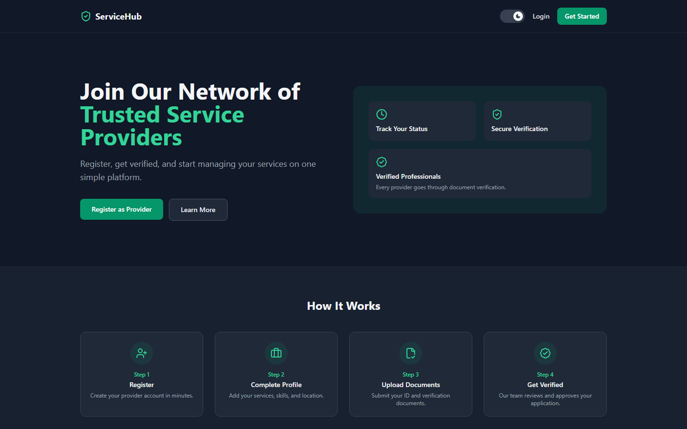 |
| Login (with Google Sign-In) | 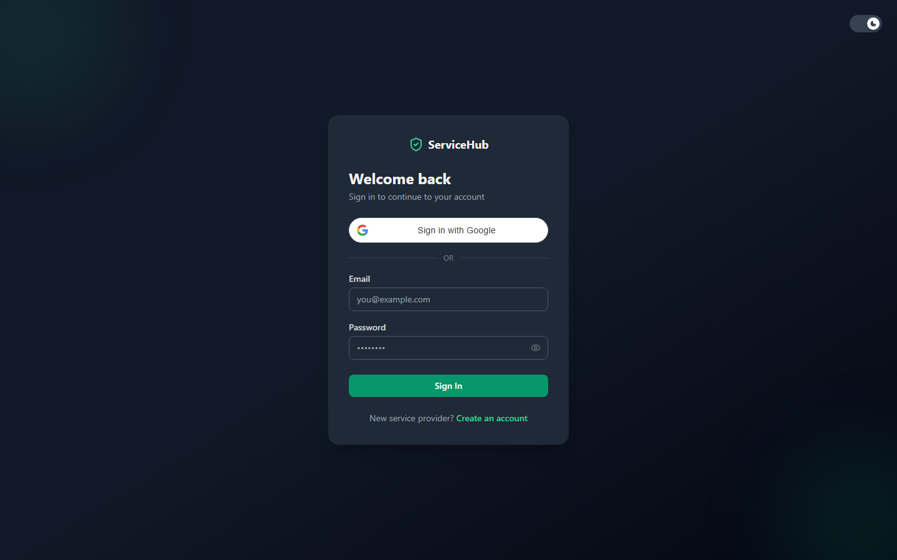 |
| Registration wizard - AI skill suggestions | 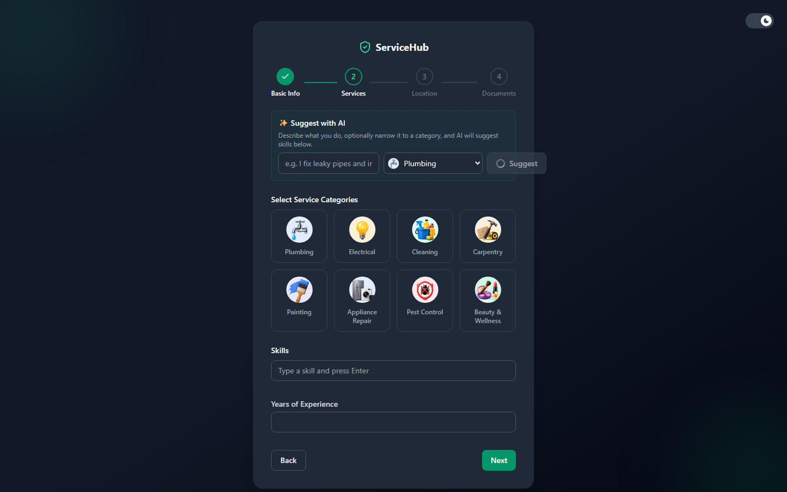 |
| Provider dashboard | 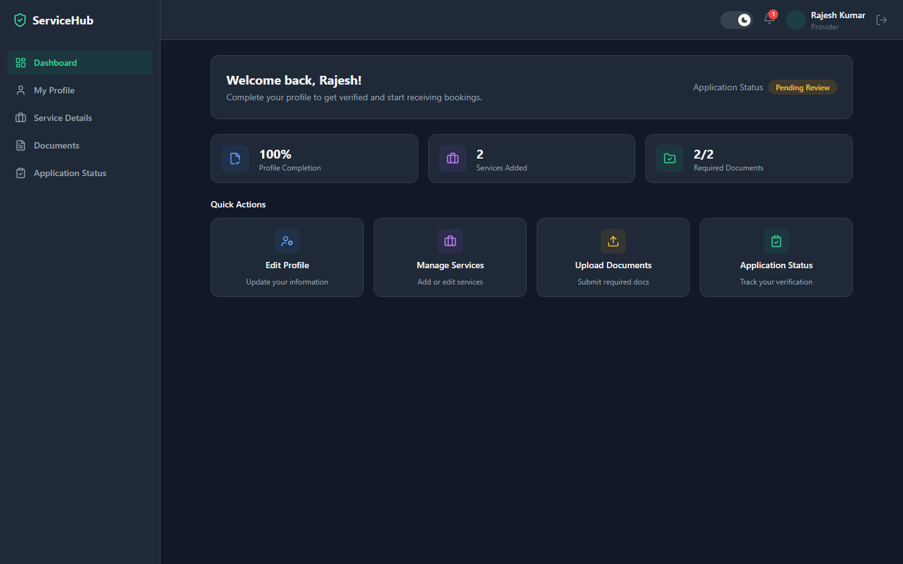 |
| Service details (categories, skills, location) | 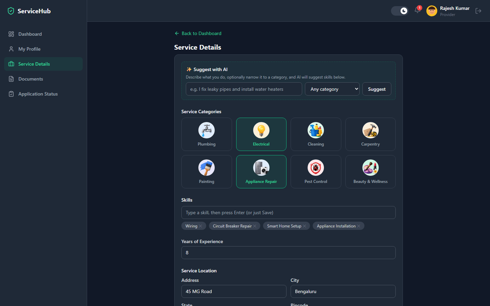 |
| Document upload + AI verification | 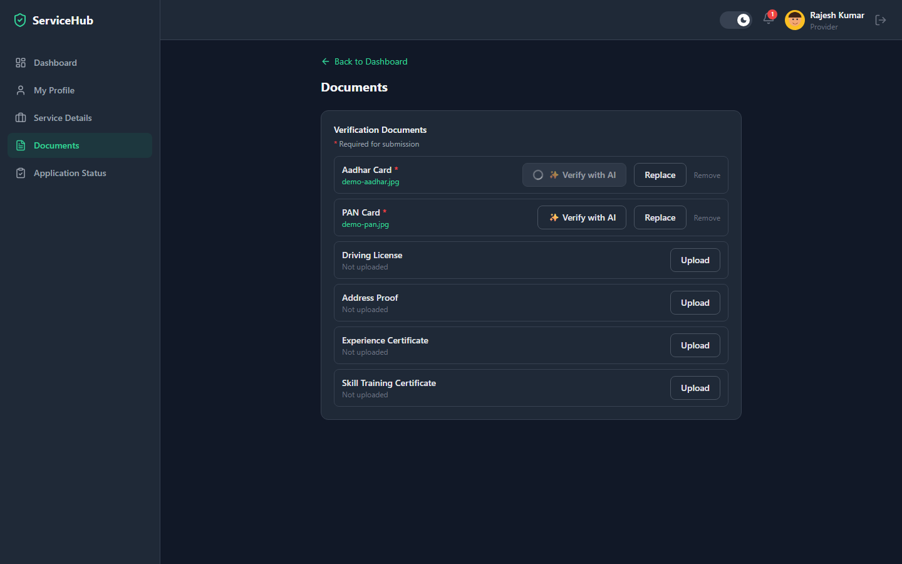 |
| Application status timeline | 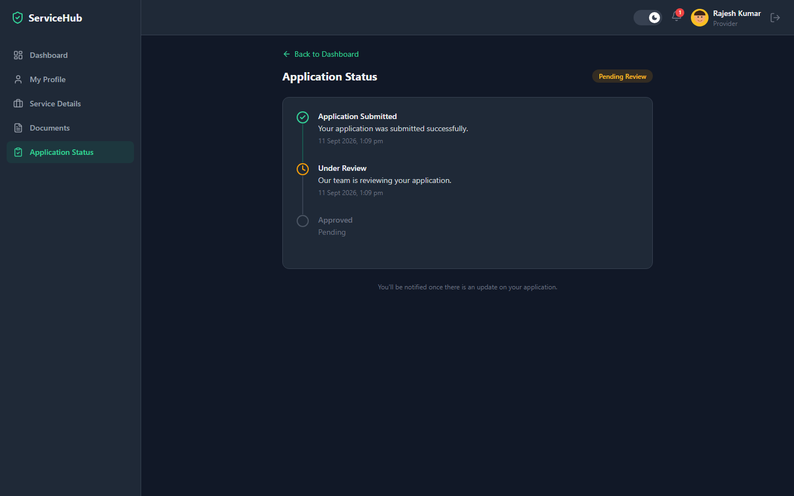 |
| In-app notifications | 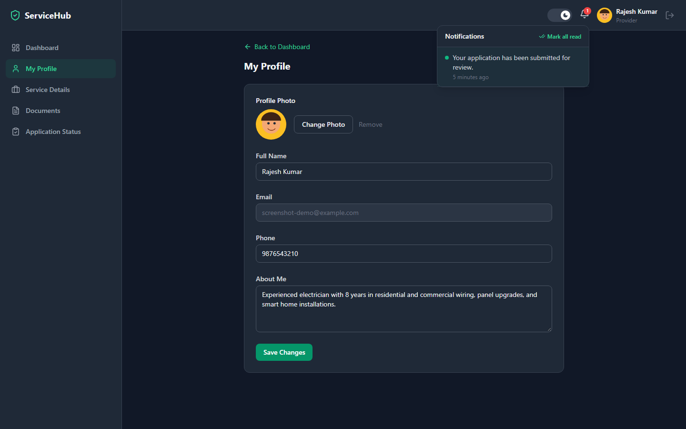 |
| Admin dashboard (stats + charts) | 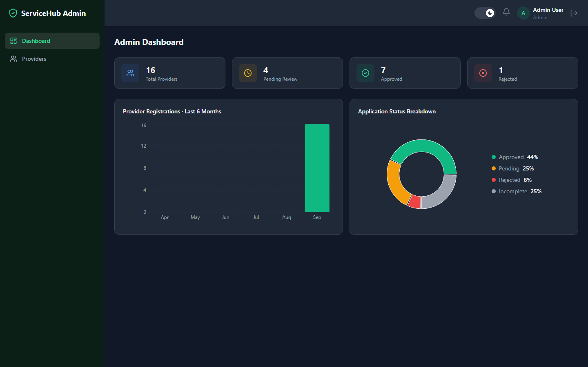 |
| Admin providers list (search/filter) | 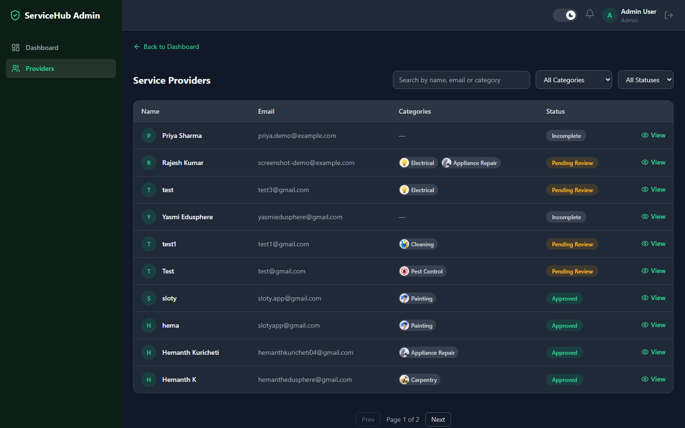 |
| Admin provider detail (approve/reject) | 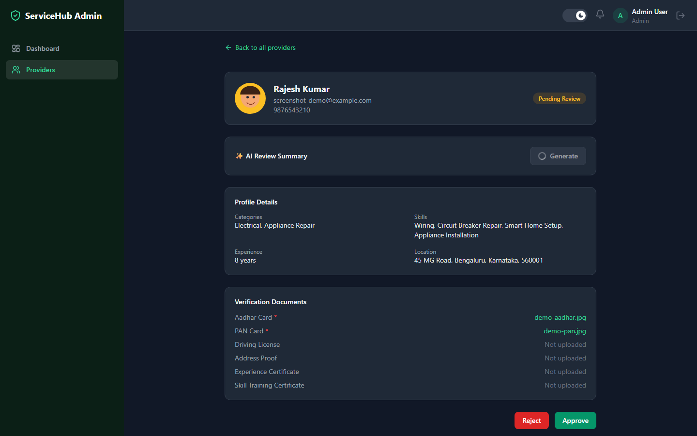 |
| Light mode | 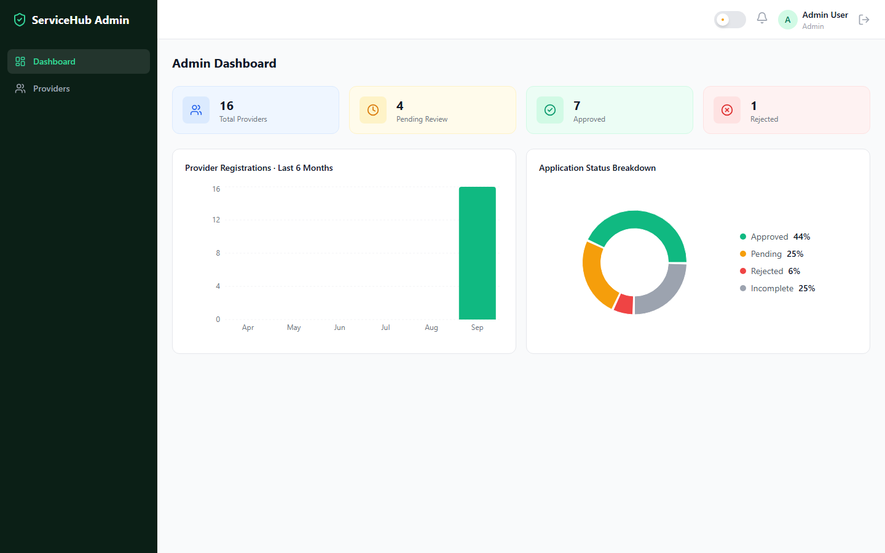 |

More in [`docs/screenshots/`](docs/screenshots/), including the full registration wizard and provider profile pages.
